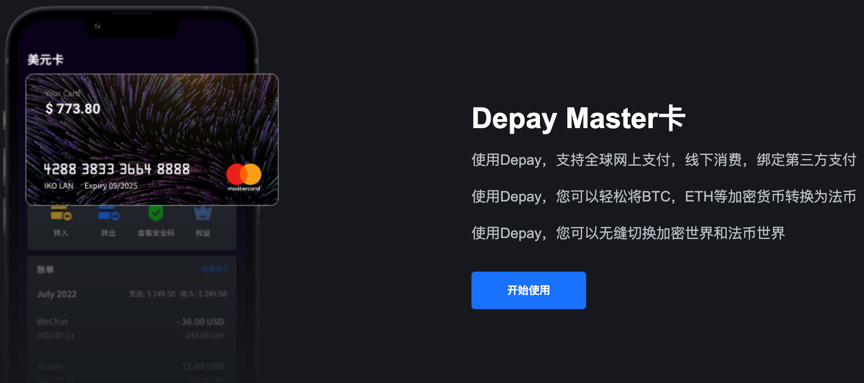
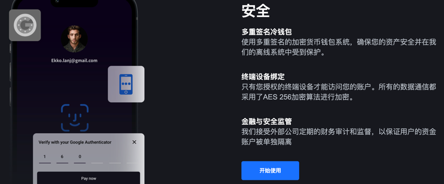
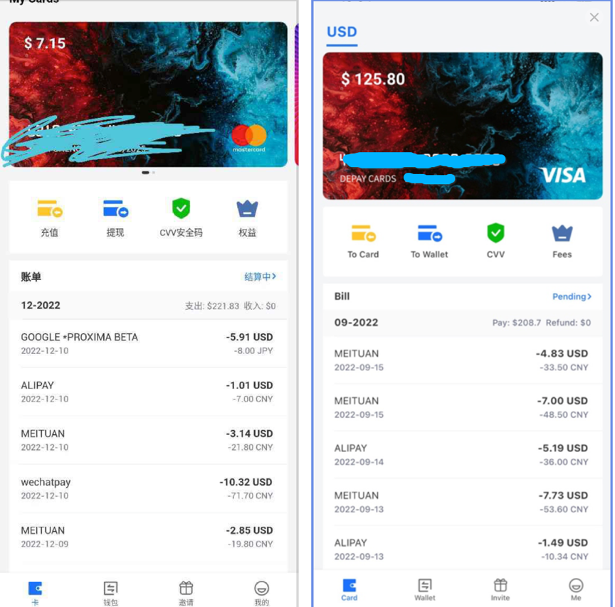
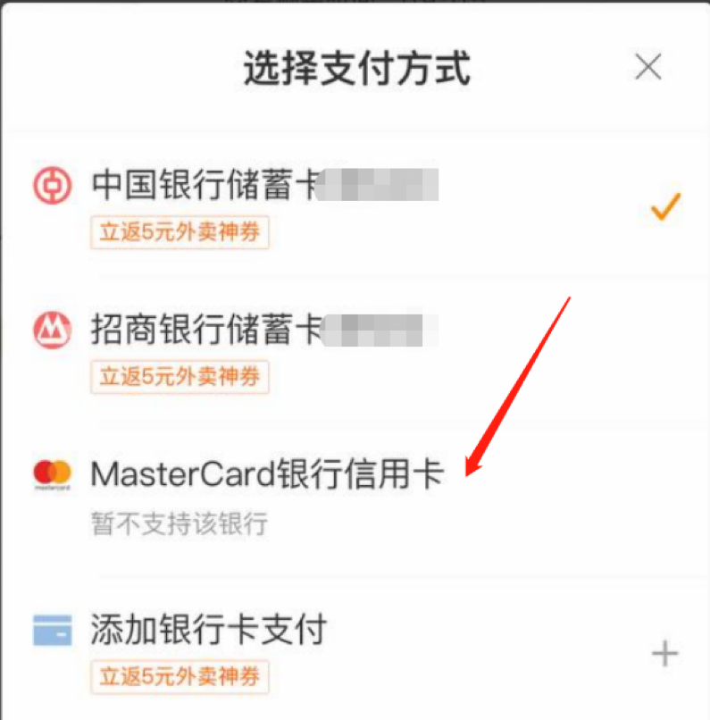
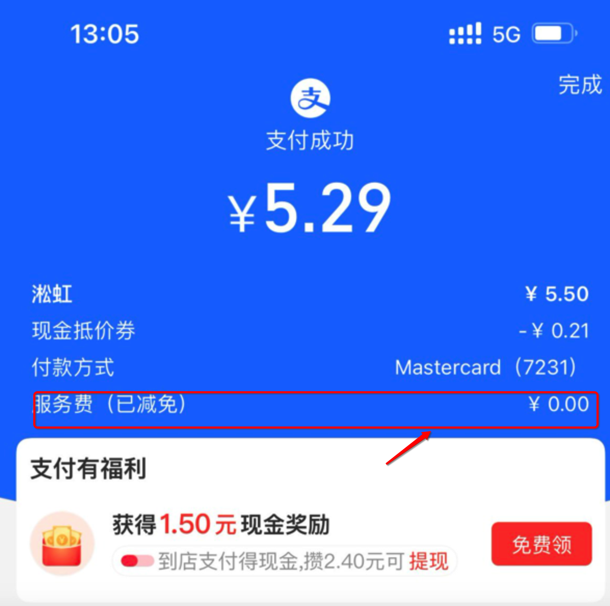
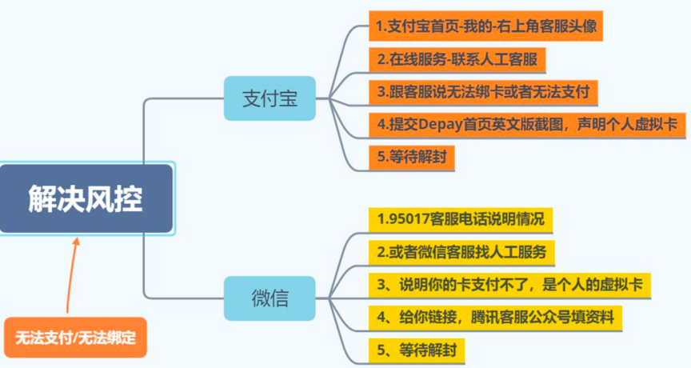
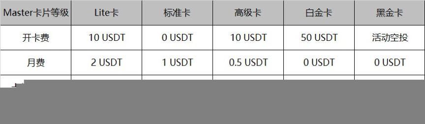

# Depay虚拟卡绑定ChatGPT以及微信、支付宝等使用场景和建议

前面我们在[《国内开通 Chat GPT Plus 保姆级教程【典藏】》](https://www.pineman.co/zh-cn/%E5%9B%BD%E5%86%85%E5%BC%80%E9%80%9Achat-gpt-plus%E4%BF%9D%E5%A7%86%E7%BA%A7%E6%95%99%E7%A8%8B%E5%85%B8%E8%97%8F/)官方教程中提到可以用当下最流行的 [Depay 虚拟卡](https://depay.depay.one/web-app/register-h5?invitCode=989274&lang=zh-cn)+[欧易交易平台](https://www.okx.com/cn/account/register?action=header_register_btn)的组合方式，来解决 OpenAI 官方不支持中国内地借记卡、信用卡给 ChatGPT Plus 以及 ChatGPT API 支付的难题。
这篇，我们就来详细介绍一下 Depay 卡，以及如何用它充值的 USDT 来绑定微信，支付宝日常小额消费。

## 什么是 Depay

Depay 是发行 VISA 和 Master 卡的数字货币钱包，支持 USDT 充值到 VISA 卡和 Master 卡，使用 Depay 可在世界范围内消费，绑定支付宝微信 PayPal 等支付工具，让你直接可用消费 USDT，用 USDT 即可进行日常开销，对于币圈人士，避免 OTC 风险。

Depay 的安全性不用特别担心，Depay 持有美国 MSB 牌照（不清楚 MSB 的可以去百度下），并接受 Fincen(金融犯罪执法局)的合规监管。Depay 采用了多重签名冷钱包技术，资产收到离线保护。

## Depay 使用场景

当前，Depay 已经上架海外苹果商店，可以使用海外 Apple ID 下载。如果是安卓就比较简单，可以直接下载。 Depay 的使用场景有：

1. Depay Master Visa 卡支持绑定支付宝、微信支付、美团外卖、拼多多、Paypal(国区、美区、港区)、天猫国际版等。
2. 支持 Stripe 商户、Google Play 商店、YouTube Premium、Paypal 商户、美区苹果商店、和支持非 3DS 卡的电商网站。
3. 支持国内苹果官网直接绑卡购买 iPhone 和 Mac，可能会打电话问询，直接说即可。
4. 暂不支持苹果支付 APPLE PAY 和谷歌 PAY。
5. 所有等级的卡（Lite、标准、高级、白金、黑金）都满足以上场景。

## Depay 日常使用建议

1. 支付宝：适合线下被扫描抢扫，也可以自己扫商家二维码使用，日常线下买菜几乎适合所有的商家（注意不要频繁扫商家支付大额），超过 200 元需要支付 3%手续费（支付宝收的不是 Depay 收）；
2. 微信：适合在京东购物，平多多购物，没有额外手续，线下二维码商家基本不支持（测试罗森便利店，永辉超市支持）。
   
3. 美团，适合点外卖，随便点；如果提示暂不支持该银行，直接选择，进行下一步输入过期日期和 CVV，就支持了。
   
4. 京东、拼多多、淘宝 在购买部分虚拟商品和海外商品时 不支持此卡支付。
5. 淘宝上和拼多多直接绑卡消费，无论多少金额都要收 3%手续费。

## Depay 如何绑定支付宝、美团、微信支付

1. 先往卡里充钱再绑定。先充钱再绑定，先充钱再绑定。
2. 绑定支付宝跟添加其他银行卡一样，输入卡号，过期日期（月/年）、CVV 即可。
3. 绑定微信支付跟添加其他银行卡一样，输入卡号，过期日期（月/年）、CVV 即可。
4. 绑定美团支付，先绑定国内一张银行卡，关闭美团急速支付，然后下订单时候付款时候，切换付款方式，选择国际卡支付，添加 Depay 的卡片号码信息即可每次点外卖时候需要输入 CVV 验证。
5. 账单地址全部填写国内实际地址即可。
6. 可以绑定美区 AppStore，如果绑定不了切换美国 IP 在尝试一下，账单地址填写美国的最好，还是不行的话联系苹果官方客服，声明这个是美国虚拟卡。
7. 不建议去绑定土区任何东西白嫖，土区一律发现一律风控。apple ID 号都可能没了。

另外，充了 USDT，绑定支付宝消费，目前还免 Mastercard 手续费，这点确实不错。

## Depay 绑定支付宝微信失败，或者使用时候失败怎么办？

支付宝绑定失败，或者支付失败，请点击[解除风控教程](https://telegra.ph/%E6%97%A0%E6%B3%95%E7%BB%91%E5%AE%9A%E6%94%AF%E4%BB%98%E5%AE%9D%E6%80%8E%E4%B9%88%E5%8A%9E%E4%B8%AD%E6%96%AD-09-02)，上传 Depay APP 首页截图。
微信绑定失败，或者支付失败怎么办，找到微信客服进行申诉，一般也是上传 Depay APP 首页截图解决（注意文字说明 Depay APP 截图上有你个人的拼音名字,客服有时候看不到）,一直申诉不行，一直给差评，直到有客服打你电话或者你自己去打微信客服电话 95017，说清楚这个是你的卡，有你的名字。

## 为什么会风控，怎么避免风控？

1. 这个是海外银行卡，国内支付工具一开始就把风险等级提高。
2. 绑定成功的第一笔消费不能消费虚拟产品，比如充值手机话费。
3. 可以在大商家内消费，比如 KFC，肯德基微信小程序消费。
4. 不能一来直接刷大额，或者超过卡片余额的超额消费。
5. 支付宝和微信慢慢正常使用养卡，单次消费金额会越来越大。
6. 先充值再使用，可以省去很多麻烦，钱不够去刷触发商家风控后，以后你再充值可能都用不了了。
7. 美团无法支付？美团找客服解决，话术是：我自己的虚拟卡，我朋友都可以用。
8. 所有的解决风控问题，都是明确这是虚拟卡，这是你本人的，不是盗刷的，理直气壮一点。
   这里提供一张支付宝、微信风控找客服的流程图——
   

## Master 卡和 Visa 卡有什么区别吗？

大部分商家都一样支持，只是费率不一样，费率如下:

## 其他注意事项

1. 不要向任何人暴露你的卡号，一些地方可以直接使用卡号小额消费，不验证 CVV。
2. 支持 ChatGPT PLUS 会员扣费，需要你的支付环境，IP 要原生 IP，如果不行开无痕模式切换 IP 多试几次。
3. 往 Depay 充值，要大于 5U，少于 5U 不到账，到账时间大概 5 分钟~10 分钟
4. 绑卡时候，国内的应用填自己的国内地址；国外的应用，搜索找个海外的地址。
5. 有其他任何使用上的问题，加入 [Depay 官方电报群](https://t.me/depay_visa) (需要使用魔法访问)，万人群，热闹的。

