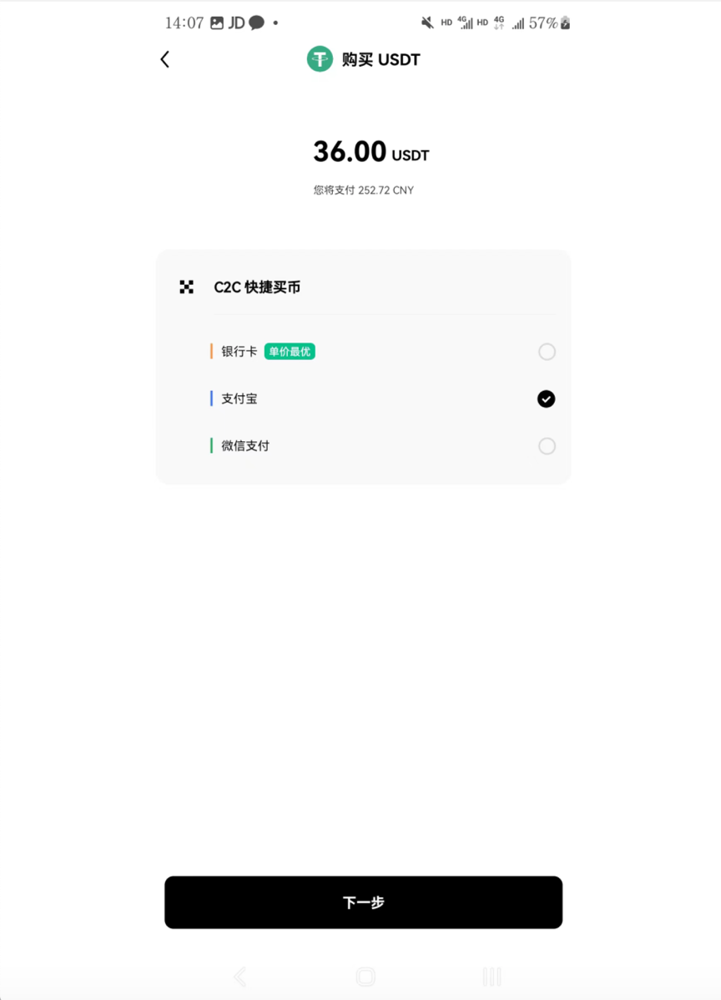
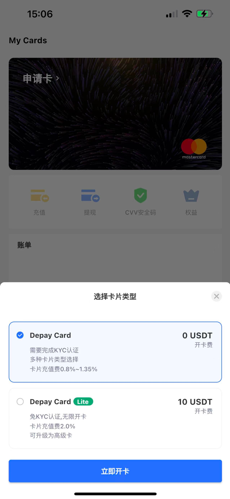
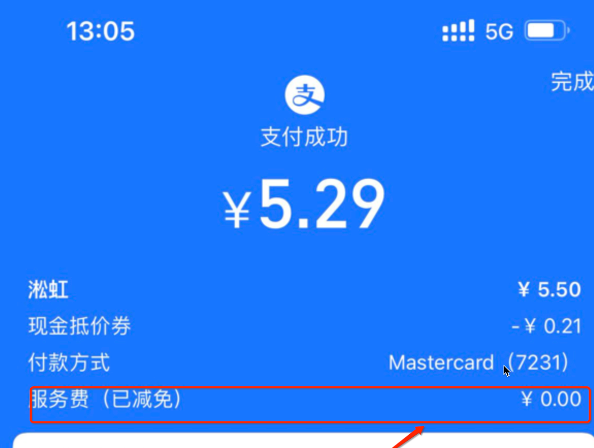
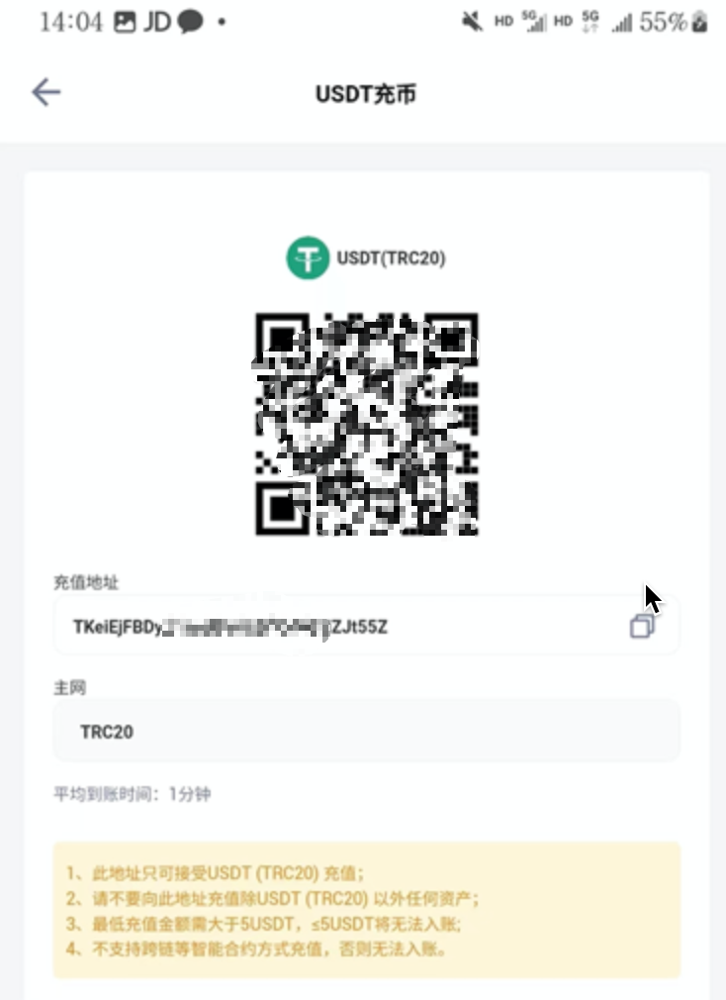
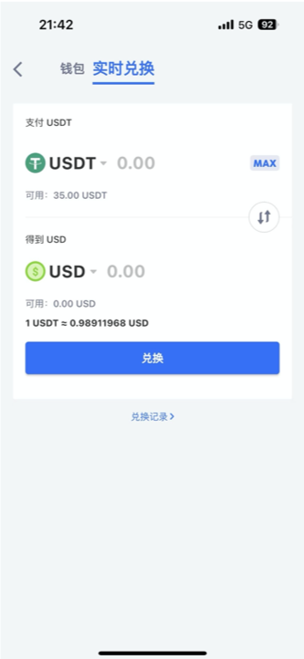
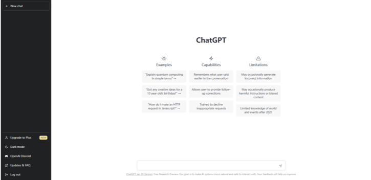
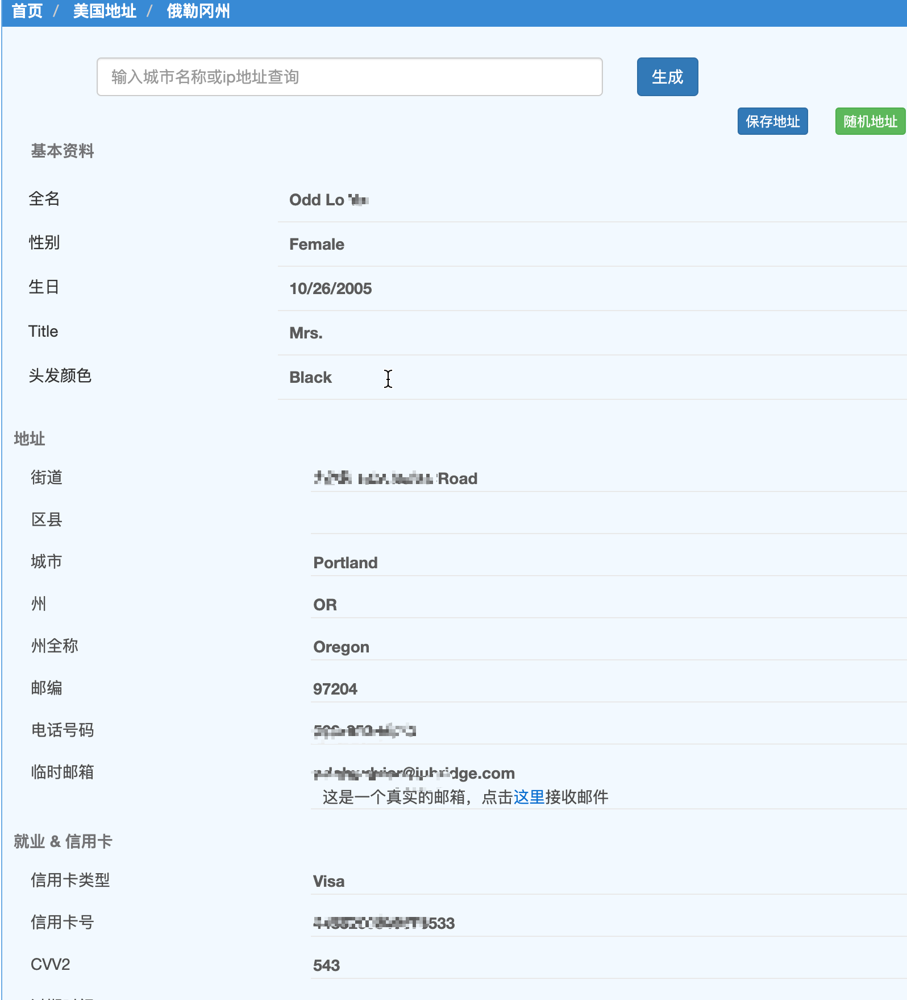
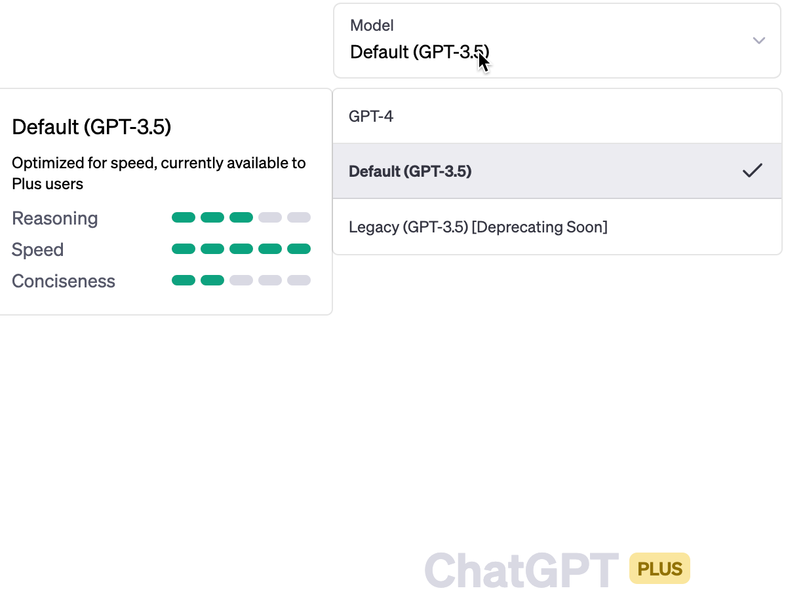

# 国内开通Chat GPT Plus保姆级教程【典藏】

## ChatGPT Plus

升级到付费版的 ChatGPT Plus 好处自然不用说，懂的都懂。比如稳定，无字数限制，不会有错误等等。
本文就分享一下本人(以及若干 ChatGPT Plus 爱好者+群友)亲测有效的 ChatGPT Plus 付费版升级流程。注册门槛说实话有点高，总结起来其实就下面 4 个步骤：

这里简单说，欧易是港股上市，国内最大的交易所，Depay 是最大的虚拟信用卡公司。

## 实操步骤

要完成上述 4 个步骤，你需要提前准备好：

1. 能正常访问 ChatGPT 的魔法上网条件（一定要选美国或者欧洲的代理节点）
2. 注册 1 个可用的 ChatGPT 账号
3. 注册 1 个虚拟交易平台[欧易账号](https://www.okx.com)
4. 申请 1 张虚拟信用卡(选 [Depay](https://depay.depay.one/web-app/register-h5?invitCode=989274&lang=zh-cn)，群里小伙伴都是用它)

### 使用魔法代理上网

代理一定要用美国或欧洲的 IP，特别是香港的 IP 已经不行了。如果你不确定自己的 IP 是不是美国或欧洲的，http://en.ipip.net/ 查看。不要用那种很多人使用的代理，容易失败。如果你自己的代理被别人污染了，我这里推荐用 [快连 VPN](https://github.com/LetsGo666/LetsGo_1)，注册时填写我的 ID: 91489903 可以获得免费 3 天试用。到目前 ChatGPT 没有被封。

### 申请 ChatGPT 账号

这一步网上有很多详细的教程，我这里就不细说了。还没有自己的 ChatGPT 账号的，先##参照国内注册一个属于自己的免费 ChatGPT 账号【附常见问题解决】 一步一步做，申请一个属于自己的 ChatGPT，这个教程注册+接验证码都有了，国内的手机号也可以完成注册。
照着做就行，只有先搞定 ChatGPT 账号，才能在此基础上升级到 ChatGPT Plus。

已经有 ChatGPT 账号的，直接进入第 2 步，走起！

### 申请[欧易账号](https://www.okx.com)完成 USDT 充值

因为 Depay 不接受人民币直接充值，所以我们必须借助交易所平台，来完成
人民币—USDT—USD 美元的兑换过程，等 Depay 账户里有 USD 美元了再给 ChatGPT Plus 充值。这里，对 USDT 不熟悉的朋友我说一下，USDT 是虚拟货币泰达币，跟 USD 美元锚定的，背后有大而不倒的金融机构担保，只要 USD 在它就在，安全性不用担心。

关于交易所，咱国内用户，受前两年国家整顿的政策影响，当下国家支持并且靠谱的大交易所目前就仅剩下欧易一家独大了，咱没得选，乖乖注册一个欧易账号就好。
[点击这里–>跳转官网注册欧易账号](https://www.okx.com/cn/account/register?action=header_register_btn)

等待欧易账号注册好，下载并安装 APP，安装过程中如果系统提示有安全风险，不必理会，对于虚拟货币，系统都会误报，咱们这是正规官网下载的，哪来的风险，忽略就好。

如果你是苹果用户，需要使用海外 AppleID 登录应用商店下载 app，关于如何申请一个海外 AppleID，这里不做赘述，去知乎上搜一下就有。

耐心等待欧易 App 安装成功，点击 App 首页——我要买币——快捷买币——选 USDT——购买至少 23USDT(大概￥ 200)——支持支付宝、微信或者银行卡购买。

做完上面这一步，就完成人民币——USDT 的兑换，也就是上面说的第一步。

这里，我多买点，买 36USDT，大概 250 人民币。

> 额外啰嗦一句——
> 虽然你们经常听到身边朋友说谁谁谁炒币炒合约翻了几百倍财富自由了什么的，确有其事。但还是不建议你去炒币，因为风险挺大的，很少人能管住自己的贪欲，确实有人赚钱，但是亏钱的也不少，大家不要轻易尝试。切记！
> 不过，新人注册欧易会送你盲盒，盲盒里有随机币种，大概也能值几 USDT，建议卖掉换成 USDT。

### 申请虚拟信用卡 Depay

1. 什么是 Depay
   首先，ChatGPT 充值要求必须美国的信用卡，咱们国内的双币卡、全币卡都不能用。
   不用说，对于国内没有美国当地信用卡的小伙伴，肯定选赫赫有名的 [Depay 美国虚拟信用卡](https://depay.depay.one/web-app/register-h5?invitCode=989274&lang=zh-cn)。

2. 注册 Depay 账号
   [点此注册 Depay 账号](https://depay.depay.one/web-app/register-h5?invitCode=989274&lang=zh-cn)，可以用邮箱或者手机号，我本人选的谷歌邮箱注册，如果验证码没收到很可能在垃圾箱里。账号注册成功后，会让你下载它们的 App 安装，苹果手机需要登录海外的 Apple 账号，安卓手机可以直接下载 apk 安装，我下载的是 depay1.2.4.apk 版本。耐心等待 APP 安装完毕，用刚刚注册的账号和密码登录 Depay。

3. 申请第一张卡
   点击界面左上角的“申请卡”开通虚拟信用卡，开卡的时候可以选 0 开卡费的，也可以选 10USDT 开卡费(一次性)的，区别是 0 开卡费的需要你完成 KYC 认证，通俗点说就是需要你上传身份证(国内身份证没问题)或者护照认证，如果你暂时不想上传自己身份证或者护照实名的话，可以先选 10USDT 开卡费的，这样，下面你就要记得多转 10USDT。 高级卡、白金卡有 10U 和 50U 的开卡费，自己决定要不要开通，区别在于月费、手续费和额度。开通后不要急着注销，因为注销了后再开卡要 10U 开卡费，你后面充值 chatgpt plus 还是要用的，建议是把 Depay 卡当做普通的信用卡用。

不得不说，拥有一张 Depay 虚拟信用卡在线上支付方面还是很方便的，它支持绑定支付宝、微信支付、美团外卖、拼多多、Paypal、天猫国际版，苹果美区商店等，具体你们可以去搜一下”Depay 作用”。

关于 Depay 的任何使用问题，都可以去 [Depay 官方电报群反馈](https://t.me/depay_visa) (需要使用魔法访问)。
卡开通后，可以往 Depay 里充值 USDT ，这一步在接下去的第 4 小章节会讲到，需要用到前面注册的欧易账号来充值 USDT。

这里忍不住安利一下， Depay 平常可以用于微信，支付宝，美团消费，直接用 USDT 做日常小额消费，还免收手续费，这还是很舒服的。关于这方面，花几分钟看下这篇文章《Depay 虚拟卡绑定 ChatGPT 以及微信、支付宝等使用场景和建议》，这里放 1 张截图，其他的不做过多阐述。

### 给钱包充值 USDT

1、 打开 Depay App 钱包，找到钱包——USDT——充币——复制你的充值地址，确认屏幕上显示主网是 TRC20，
充值地址千万不要复制错，比如我的 Depay 钱包的 USDT 充值地址是 TKeiEjFBDyJTAb89YhXXXXXXXX55Z。

2、 打开上面第 2 步注册的欧易 App，找到首页——资产——提币——USDT——链上提币。
提币地址填 Depay 钱包里的充值地址，这里我填 TKeiEjFBDyJTAb89YhXXXXXXXX55Z，
提币网络选 TRC20 (千万不能选错，否则到不了账)，
数量选大于 23USDT 就行，够充值 1 个月 ChatGPT Plus 会员就行。
提交，等待到账。

3、欧易提现到 Depay 成功后，点击 Depay App 钱包——兑换，将所有的 USDT 都兑换成 USD 美元

4、点击 Depay App 首页的 To Card，将兑换的美元存入卡中，到此，Depay 充值大功告成。

📢📢📢 注意
需要注意的是，新注册的欧易用户默认完成身份认证后，需要等待 24 小时才可以提现，如果你着急提现到 Depay，你可以尝试找一下人工客服，说下你的诉求，据群友反馈，有一定概率可以解除 24 小时等待。万一你真的特别着急，你也可以去微博上找 depay 代充，一般对方会按照汇率 1:8 收点劳务费。不是很急的话建议 24 小时就行，不必花这冤枉钱。

## 开通 ChatGPT Plus

我们已经在第 3 步中拥有了一张属于自己的虚拟信用卡(其实相当于借记卡，不可透支)，并且往里面充了 20 多美刀，够我们订阅 1 个月 ChatGPT Plus 了。
登录 ChatGPT, 左下角找到升级 Plus 的选项——Upgrade to Plus

一些群友反馈没有出现这个升级的选项，记得把 IP 切换到美国或者欧洲再重新登陆，现阶段只有美国或欧洲的 IP 才会有这个选项，(升级的时候需要国际 IP，升级完毕后不要求)。

**另外，切记切记——**

1. 魔法上网，尽量用美国或者欧洲 IP
2. 浏览器开启无痕模式
3. 账单地址用美国免税州的地址生成器生成
4. 如果 1、2 都做了还是失败，那么尝试清空浏览器缓存，无痕登录，重新登录 ChatGPT 再尝试。如果还是不行，那么建议更换你目前在用的代理节点再试，直到成功。

### 关于账单地址

理论上随便填都行，你可以网上搜美国地址生成器，直接生成一个免税州的账单地址:

请一定要用美国或者欧洲的 IP 访问，不行的话多切几个节点试验，否则可能会遇到如下报错，这里没有其他办法。

## 四、ChatGPT Plus 初体验

看到如下 PLUS 的尊贵标识，就说明你已经成功开通 ChatGPT Plus 了。
只能说，这钱花的值，你将拥有了 AI 的丝滑体验。

每个月大概不到￥ 150，也就 3 杯星巴克的钱，换来的是一个高效的信息获取渠道，不亏，是一个跨时代的生产力。

至此，恭喜您，已经成为了尊贵的 ChatGPT Plus 用户，成为全球走在时代前沿的人了。从现在起，访问 ChatGPT Plus 就拥有 Default 和 Legacy 双模型回答，以及快速、稳定的 AI 回复。

## 常见问题&解决

这里汇总了群友最常遇到的一些问题及解决办法如下——

1. 如何取消 ChatGPT Plus 的自动订阅？
   > 上面说过，我们的 Depay 信用卡其实没有透支功能，只是相当于借记卡，理论上说只要你不往卡里充钱，其实不必担心下个月被扣款。不过，保险起见，你还是可以取消自动订阅，方法是：
   > 打开 ChatGPT 首页并登录——左下角——My Account——Manage My Subscription——Cancel Plan
2. ChatGPT Plus 中的 default mode 和 legacy mode 有什么区别？

   > default mode 就是 Turbo mode，它会更有情感和活力，会有趣一些，不过回答上偏更加简洁，省去了之前 legacy mode 一些细节。
   > legacy mode 则更适合学术论文，不像 Turbo Mode 回答那么大众，适合科研，论文。
   > 更详细的比较可以参考：https://www.reddit.com/r/ChatGPT/comments/111skny/the_differences_between_default_and_legacy_models/

3. 信用卡被拒，提示：”你的信用卡被拒绝了，请尝试用借记卡支付“
   > 信用卡被拒可能有以下几个原因：
   > 你的信用卡确实不支持，比 Depay 的虚拟信用卡的号段被 OpenAI/ChatGPT 拒绝。可以尝试更换虚拟信用卡，Depay 支持申请多张。
   > 你的网络环境被 Stripe 风控，挂全局代理 + 浏览器无痕模式再试，总之挂代理和不挂代理都试一下
   > 全局代理 + 浏览器无痕模式 + 更换 IP 失败次数超过 3-5 次，不建议继续尝试，这种情况可以考虑更换 ChatGPT 账号 + 无痕 + 更换梯子重新订阅试试。
4. 为什么升级到 ChatGPT Plus 需要这么麻烦？
   > 这个问题归根结底是因为 openAI 不支持 PayPal 充值，大家没事就写 e-mail 给 openai 的 ceoSam Altman(国人喊他奥特曼)，让他早点支持支持 payPal
5. 升级 ChatGPT Plus 每个月$20 值不值？
   > 这是一个仁者见仁智者见智的问题，你觉得值它就值，你觉得不值，就尝试下取消续费就好。不过，应该没人会拒绝更优越的生产力吧？

