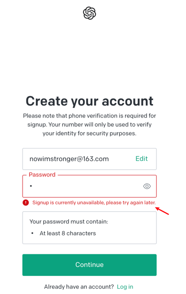

# 国内注册一个属于自己的免费ChatGPT账号【附常见问题解决】

## Sms-active 接码平台

### 申请 1 个账号

打开官方接码平台[sms-activate.org](https://sms-activate.org/?ref=3057023)，用邮箱注册一个账号，这里我用邮箱注册，激活账号并登录，此时可以看到右上角余额为 0。

好了，账号注册完毕，先充值，后面用于购买国外手机号的短信验证码。

### 充值余额

接收 1 次 OpenAI 的验证码费用是大概 11 卢布（现在火起来后稍微贵了一些），折合人民币大约是 1 块钱，不过 sms-active 平台充值只支持美刀，且最低要求充值 1 美元(约等于 76 卢布)，谁让人家是一家独大呢。
点击右上角——充值——直接选择支付宝支付完成充值：

充值完毕，稍后刷新页面，右上角账户余额就会更新(如果没更新，多等一会儿)。

OK，暂时先不管接码平台，我们先去 ChatGPT 之父山姆·奥特曼创办的 OpenAI 公司网站申请 1 个账号，过程中再返回来用接码平台。

## OpenAI 官方账号

### 申请 1 个 OpenAI 账号

首先打开 [OpenAI 的账户注册页面](https://beta.openai.com/signup)。谷歌注册或者邮箱注册都可以，无所谓，我们这里用邮箱注册作为例子。
由于某些原因，OpenAI 官网需要使用科学网络才可以访问，如果你的科学网络不够稳定，我这里推荐用 [快连 VPN](https://github.com/LetsGo666/LetsGo_1)，注册时填写我的 ID: 91489903 可以获得免费 3 天试用。到目前 ChatGPT 没有被封。

如果你已经有谷歌或者微软账号，可以直接登录，如果没有也没关系，选择邮箱注册，登录邮箱激活账号。注意这里容易遇到问题，详见文末“问题及解决办法章节”。

如果顺利，您将会看到如下注册页面——

这里，提供你的用户名和姓，并点击继续，OpenAI 会要求你输入手机号码，注意，因为不支持国内的手机号码，所以，我们才需要上面第 1 步注册的接码平台，利用接码平台购买一个临时的国外手机号来接收验证码。

### 购买验证码

回到接码平台 [sms-activate.org](https://sms-activate.org/?ref=3057023)，在左侧搜索“OpenAi”，然后点击印度——点击购物车购买。选择印度的原因是当前，截止到目前为止，印度的号码成功率最高。

复制你购买的这个印度号码，在这里，我是+91（789）2418047，你的跟我不一样。

将号码粘贴到 OpenAI 的注册页面输入框里，点击下方的“发送验证码”按钮，

在接码平台页面，点击右侧的刷新按钮，看到 6 位数验证码已经显示在网页上了，复制填写，完成 OpenAI 注册过程。

这里，当你看到这个页面，就可以确定你的 OpenAI 账号已经注册成功了。这里不用管，随便选，我们下面直接去 chatgpt 网站去登录就好。

### 登录 ChatGPT

注册好了 OpanAI 账号，就可以直接登录 ChatGPT 了，点击 [ChatGPT 网站](https://chat.openai.com/auth/login) 跳转登录，尽情享受跟 ChatGPT 的第一亲密接触吧。这里，我尝试让 ChatGPT 帮我写一篇介绍如何通过 sms-activate.org 平台注册 chatgpt 账号的文章，看起来回答地还不错。

## 遇到问题及解决办法

### 注册 OpenAI 账号遇到“Signup is currently unavailable, please try again later” (如下图)

> 解决办法：不要用 163 邮箱，用微软，qq, gmail 都行

### 登录 OpanAI 账号遇到“Not available, OpenAI‘s service are not available in your country“不能在当前国家服务的提示(如下图)

> 解决办法：切换科学网络(梯子)的节点 IP 并刷新页面重试，根据经验，日本、韩国和欧洲的成功率高。

### 登录 chatgpt 网站，遇到“Access denied, You do not have access to chat.openai.com … Error reference number 1020”错误

> 解决办法：地区限制造成的，推荐用 [快连 VPN](https://github.com/LetsGo666/LetsGo_1)，切换到欧美的节点，并清除浏览器缓存。

### 使用 ChatGPT 过程中，遇到了如下这些错误：

> 错误： “Too many requests in 1 hour. Try again later”
> ——1 小时请求超次数限制了

## 总结

怎么说呢，免费的毕竟是不稳定的，还是有限制的，申请完体验一下还可以，要是真想把 ChatGPT 变成我们自己的准备长期用，如果有条件，还是建议按照我之前写的这篇[国内开通 Chat GPT Plus 保姆级教程【典藏】](https://www.pineman.co/zh-cn/%E5%9B%BD%E5%86%85%E5%BC%80%E9%80%9Achat-gpt-plus%E4%BF%9D%E5%A7%86%E7%BA%A7%E6%95%99%E7%A8%8B%E5%85%B8%E8%97%8F/#)，升级到 ChatGPT Plus，一劳永逸!

毕竟，生产力的提升，对我们自己的帮助是巨大的。

